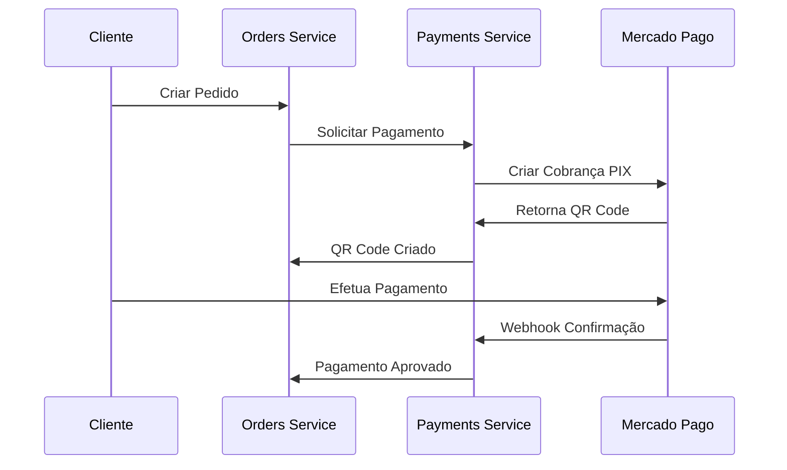
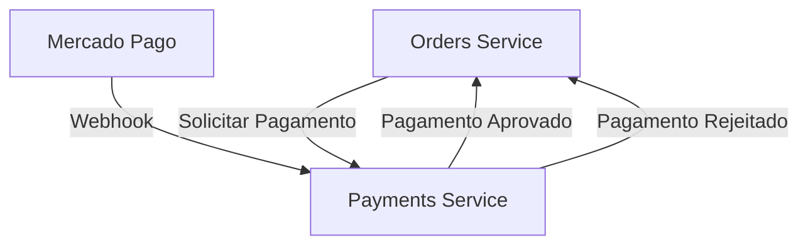

# FIAP Food Payments - Microsserviço de Pagamentos

## 📋 Descrição

Este é o microsserviço responsável pela operacionalização da cobrança de pedidos da lanchonete FIAP Food, incluindo:

- Processamento de pagamentos via PIX
- Integração com Mercado Pago
- Geração de QR Codes para pagamento
- Webhook para confirmação de pagamentos
- Atualização de status de pedidos

## 🏗️ Arquitetura

### Tecnologias Utilizadas
- **Framework**: NestJS
- **Banco de Dados**: MongoDB (NoSQL)
- **ORM**: Mongoose
- **Gateway de Pagamento**: Mercado Pago
- **Mensageria**: RabbitMQ
- **Containerização**: Docker
- **Orquestração**: Kubernetes
- **Cloud**: AWS EKS

### Padrões Arquiteturais
- **Clean Architecture**
- **CQRS (Command Query Responsibility Segregation)**
- **Event Sourcing**
- **Domain-Driven Design (DDD)**

## 🧪 Testes e Qualidade

### Cobertura de Testes
Este projeto mantém uma cobertura de testes superior a **80%** conforme exigido:


#### Tipos de Teste Implementados:
- ✅ **Testes Unitários** - Jest
- ✅ **Testes de Integração** - Jest + Supertest
- ✅ **Testes BDD** - Cucumber
- ✅ **Testes de Aceitação** - Cucumber + Docker

### Executar Testes

```bash
# Testes unitários
npm run test

# Testes com cobertura
npm run test:cov

# Testes de integração
npm run test:integration

# Testes BDD/Aceitação
npm run test:acceptance

# Todos os testes
npm run test:all
```

### Relatórios de Cobertura

Os relatórios de cobertura são gerados automaticamente e podem ser encontrados em:
- **Arquivo local**: `./coverage/lcov-report/index.html`
- **CI/CD**: Integrado com SonarQube
- **Badge**: 

## 🚀 Deploy e CI/CD

### Pipeline de Deploy
O projeto utiliza GitHub Actions para CI/CD com as seguintes etapas:

1. **Análise de Código** (ESLint + SonarQube)
2. **Build da Aplicação**
3. **Testes Unitários**
4. **Testes de Integração**
5. **Testes de Aceitação**
6. **Build do Container Docker**
7. **Deploy no Kubernetes (AWS EKS)**

### Proteção de Branches
- ✅ Branch `main` protegida
- ✅ Require pull request reviews
- ✅ Require status checks to pass
- ✅ SonarQube quality gate (70% coverage mínimo)

## 📚 Funcionalidades

### Endpoints Principais

#### Pagamentos
- `POST /payments` - Criar solicitação de pagamento
- `GET /payments/:id` - Consultar status do pagamento
- `POST /payments/webhook` - Webhook do Mercado Pago
- `GET /payments/qrcode/:id` - Obter QR Code para pagamento

### Fluxo de Pagamento



### Comunicação com Outros Microsserviços



## 💳 Integração Mercado Pago

### Configuração PIX

```typescript
const paymentData = {
  transaction_amount: total,
  payment_method_id: 'pix',
  payer: {
    email: customer.email,
    identification: {
      type: 'CPF',
      number: customer.cpf
    }
  }
};
```

### Webhook Configuration

```typescript
@Post('/webhook')
async handleWebhook(@Body() notification: MercadoPagoNotification) {
  // Processar notificação de pagamento
  if (notification.type === 'payment') {
    await this.updatePaymentStatus(notification.data.id);
  }
}
```

## 🐳 Executar Localmente

### Pré-requisitos
- Node.js 20.9+
- Docker
- Docker Compose
- Conta no Mercado Pago (para obter Access Token)

### Instalação

```bash
# Clonar o repositório
git clone https://github.com/thallis-andre/fiap-soat10-payments.git
cd fiap-soat10-payments

# Instalar dependências
npm install

# Configurar variáveis de ambiente
cp .env.example .env

# Iniciar dependências (MongoDB, RabbitMQ)
docker-compose up -d

# Iniciar a aplicação
npm run start:dev
```

### Variáveis de Ambiente

```env
NODE_ENV=development
PORT=3001
MONGODB_URI=mongodb://localhost:27017/fiap-food-payments
RABBITMQ_URL=amqp://localhost:5672
MERCADO_PAGO_ACCESS_TOKEN=your_access_token_here
WEBHOOK_URL=https://your-domain.com/payments/webhook
```

## 📊 Monitoramento

### Health Check
- **Endpoint**: `/health`
- **MongoDB**: Verificação de conectividade
- **RabbitMQ**: Verificação de conectividade
- **Mercado Pago**: Verificação de conectividade

### Logs
- **Framework**: Winston
- **Formato**: JSON estruturado
- **Níveis**: error, warn, info, debug

## 🔒 Segurança

### Webhook Validation
- Validação de assinatura do Mercado Pago
- Verificação de IPs permitidos
- Rate limiting para endpoints públicos

### Dados Sensíveis
- Tokens criptografados
- Dados de pagamento não armazenados
- Logs sanitizados

## 🏷️ Versionamento

Este projeto segue o padrão [Semantic Versioning](https://semver.org/).

## 👥 Autor

- **Desenvolvedor/Arquiteto**: Thallis André Faria Moreira - RM360145

## 

Este projeto é propriedade da FIAP - Faculdade de Informática e Administração Paulista.